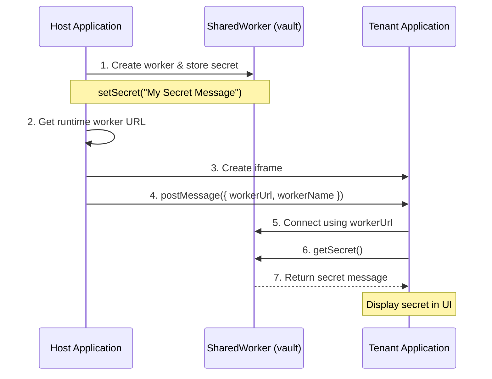
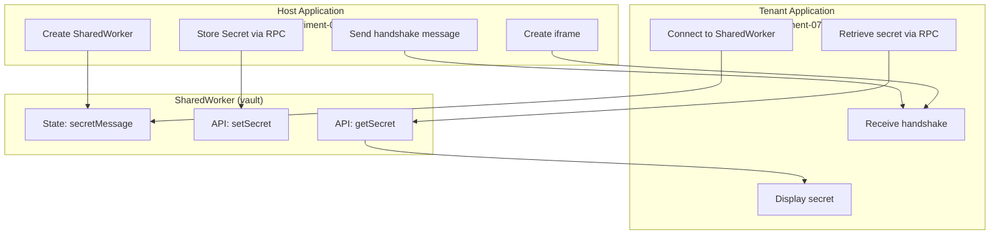

# experiment-07: Handshakes - Host-to-Tenant SharedWorker Communication

## Sessions

- https://opencode.ai/s/fittNv1F

## Overview

Demonstrates secure communication handshake pattern where a host application provisions a tenant application (loaded in an iframe) with access to a shared worker containing a secret message. The host creates the worker, stores a secret, then sends the worker's runtime URL to the tenant, which connects and retrieves the secret.

## Architecture



### Component Diagram



## Component Responsibilities

### Host Application (`/experiment-07/src/App.tsx`)

- Create and initialize shared worker
- Store secret message in worker via RPC
- Dynamically determine worker runtime URL
- Create iframe pointing to tenant
- Send handshake message with worker details to tenant

### Tenant Application (`/experiment-07/tenant/src/App.tsx`)

- Listen for handshake message from parent window
- Extract worker URL and name from message
- Create SharedWorker client with provided details
- Retrieve and display secret message

### SharedWorker (`/experiment-07/src/shared-worker/vault/`)

- Store secret message in worker state
- Expose `getSecret()` RPC method via Comlink
- Support multiple clients (host + tenant)

## Message Protocol

### Host → Tenant Handshake

```typescript
{
  type: "worker-handshake",
  workerUrl: string,    // Runtime URL (e.g., /assets/worker-ABC123.js)
  workerName: string    // Worker identifier
}
```

## Implementation

This experiment demonstrates:

- Dynamic worker URL discovery at runtime (avoiding hardcoded paths)
- Secure provisioning pattern for iframe-based tenants
- SharedWorker state sharing between host and tenant
- Comlink RPC for type-safe worker communication
- Cross-context communication via postMessage + SharedWorker

## Usage

1. Start the dev server: `npm run dev`
2. Navigate to: <http://localhost:5173/experiment-07/>
3. Host loads and creates shared worker with secret message
4. Host creates iframe loading tenant application
5. Tenant receives worker details and connects
6. Tenant displays the secret message retrieved from worker

## Key Technical Details

- Worker URL is discovered at runtime using `new URL('./worker.ts', import.meta.url)` pattern
- Vite handles worker bundling and provides the resolved URL
- SharedWorker name ensures host and tenant connect to same instance
- Comlink abstracts postMessage complexity for worker RPC
- No hardcoded URLs in tenant - fully dynamic provisioning
